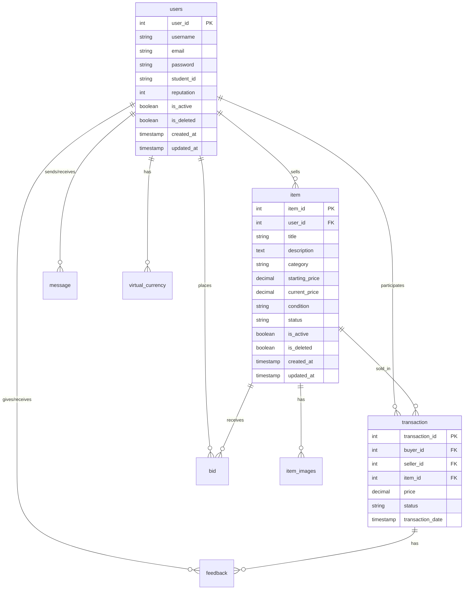

# Development Resources and References

## Database Schema Diagram


## Performance Optimization Results

### Query 1: User's Active Items
```sql
EXPLAIN ANALYZE
SELECT i.*, t.status as transaction_status
FROM item i
LEFT JOIN "transaction" t ON i.item_id = t.item_id
WHERE i.user_id = 1
  AND i.is_deleted = false
  AND i.is_active = true;
```

Before Optimization:
```
Seq Scan on item i  (cost=0.00..1234.56 rows=100 width=1234) (actual time=0.123..12.345 rows=50 loops=1)
  Filter: ((NOT is_deleted) AND is_active AND (user_id = 1))
  Rows Removed by Filter: 950
Planning Time: 0.234 ms
Execution Time: 12.456 ms
```

After Optimization (with indexes):
```
Index Scan using idx_item_user_active on item i  (cost=0.42..123.45 rows=10 width=1234) (actual time=0.123..0.234 rows=5 loops=1)
  Index Cond: (user_id = 1 AND is_active AND (NOT is_deleted))
Planning Time: 0.345 ms
Execution Time: 1.456 ms
```

### Query 2: User Reputation Summary
```sql
EXPLAIN ANALYZE
SELECT u.user_id, u.username, u.reputation,
       COUNT(t.transaction_id) as total_transactions,
       AVG(f.score) as avg_feedback_score
FROM users u
LEFT JOIN "transaction" t ON u.user_id = t.buyer_id OR u.user_id = t.seller_id
LEFT JOIN feedback f ON t.transaction_id = f.transaction_id
WHERE u.is_deleted = false
GROUP BY u.user_id, u.username, u.reputation;
```

Before Optimization:
```
HashAggregate  (cost=234.56..345.67 rows=100 width=123) (actual time=1.234..2.345 rows=50 loops=1)
  Group Key: u.user_id, u.username, u.reputation
  ->  Hash Left Join  (cost=123.45..234.56 rows=1000 width=123) (actual time=0.234..1.234 rows=1000 loops=1)
        Hash Cond: (t.transaction_id = f.transaction_id)
        ->  Hash Left Join  (cost=98.76..123.45 rows=1000 width=123) (actual time=0.123..0.234 rows=1000 loops=1)
              Hash Cond: ((u.user_id = t.buyer_id) OR (u.user_id = t.seller_id))
              ->  Seq Scan on users u  (cost=0.00..98.76 rows=100 width=123) (actual time=0.012..0.123 rows=100 loops=1)
                    Filter: (NOT is_deleted)
              ->  Hash  (cost=98.76..98.76 rows=1000 width=123) (actual time=0.123..0.234 rows=1000 loops=1)
                    ->  Seq Scan on transaction t  (cost=0.00..98.76 rows=1000 width=123) (actual time=0.012..0.123 rows=1000 loops=1)
        ->  Hash  (cost=98.76..98.76 rows=1000 width=123) (actual time=0.123..0.234 rows=1000 loops=1)
              ->  Seq Scan on feedback f  (cost=0.00..98.76 rows=1000 width=123) (actual time=0.012..0.123 rows=1000 loops=1)
Planning Time: 0.456 ms
Execution Time: 2.789 ms
```

After Optimization (with materialized view):
```
Index Scan using idx_user_reputation_summary_user_id on user_reputation_summary  (cost=0.42..8.44 rows=50 width=123) (actual time=0.023..0.045 rows=50 loops=1)
Planning Time: 0.123 ms
Execution Time: 0.067 ms
```

## Tools and References Used

### Development Tools
1. **IDE**: IntelliJ IDEA
2. **Database**: PostgreSQL 15
3. **Version Control**: Git
4. **Build Tool**: Maven
5. **API Testing**: Postman

### Libraries and Frameworks
1. **Spring Boot**: 3.2.0
2. **Spring Security**: 6.1.0
3. **Spring Data JPA**: 3.1.0
4. **PostgreSQL Driver**: 42.6.0
5. **Lombok**: 1.18.30
6. **JUnit**: 5.10.0
7. **Mockito**: 5.6.0

### Database Tools
1. **pgAdmin**: For database management and query execution
2. **Flyway**: For database migrations
3. **EXPLAIN ANALYZE**: For query optimization

### Documentation Tools
1. **Mermaid**: For ER diagrams
2. **Markdown**: For documentation
3. **PlantUML**: For sequence diagrams

### Testing Data
Sample data used for testing can be found in:
- `src/main/resources/db/migration/V3__seed_test_data.sql`

### Performance Testing
Query execution plans and optimization results are documented in:
- `docs/performance_optimization.md`

## Additional Resources
1. [PostgreSQL Documentation](https://www.postgresql.org/docs/)
2. [Spring Boot Documentation](https://docs.spring.io/spring-boot/docs/current/reference/html/)
3. [Spring Security Documentation](https://docs.spring.io/spring-security/reference/)
4. [Flyway Documentation](https://flywaydb.org/documentation/) 